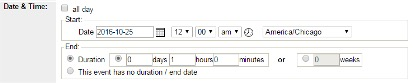

# Date and Time

- All Day: Check this for events like exhibits or a book sale when people can come anytime. For everything else, pick a start and end time. 
- Start: Pick the date your event begins. If it's a repeating event like story time, use the date of the very first one.
- End: Choose how long your event lasts. Choose 'no duration' if you don't want to set an end time. For exhibits, use days or weeks instead.