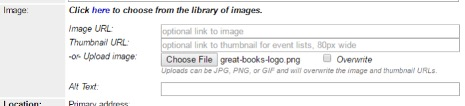

# Image

## Add From Image Library 

   1. Use an image from the [Image Library](../image-library/topic-logos.md).
   1. Use _Click here to choose from the library of images_ link to see if an image/logo already exists for a recurring or themed program.
   1. Copy the Image URL from the table. Paste into the Image URL field on the form.
   1. Copy the Thumbnail URL from the table. Paste into the Thumbnail URL on the form.
   1. Copy the Alt Text from the table. Paste into the Alt Text field on the form.

### Use Cover Image from Library Catalog

   1. Go to the [library catalog](https://catalog.library.nashville.gov).
   1. Search for the book or movie title.
   1. Go to Item detail page. Don’t copy the image from the results list because it is too small.
   1. On the item detail page, right click on the cover image and select “Copy Image location” / "Copy image address" / "Copy Shortcut" (if you’re using Windows, right-click, click Properties, and copy the URL). The URL will look something like this: '<https://catalog.library.nashville.gov/bookcover.php?id=7d5b2865-fb8b-9583-b5f9-b0d0ad2e733c-eng&size=medium>'.
      1. Paste the image URL into both the Image URL and Thumbnail URL fields.
      1. In the Image URL field, edit the URL to replace the word “medium” with the word “large”. This allows the event to display correctly on digital signs for book clubs.

## Upload an Image to Bedework

1. Find an image (see Image section of guide for copyright-friendly image sources) and save it to your computer.
1. Resize the image. See [Image Guidelines](../using-images/image-guidelines.md#size-and-text-specifications) for requirements.
1. Save the resized image to your computer. Make sure there are no blank spaces in the image file name (e.g., remane file from “stack of books.jpg” to "stack_of_books.jpg").
1. In the Image section of the Bedework event form (when adding an event), click Choose File.
1. Find the resized image on your computer and click Open.
1. Upon success,see a file name after the “Choose File” button.
1. Your image will be visible in the event listing after you click Add Event at the end of the form.
