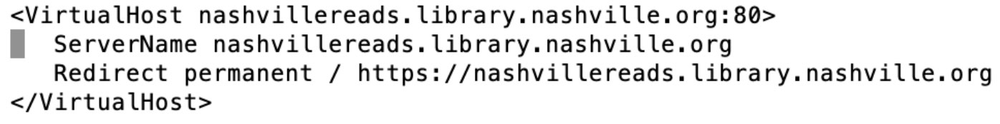
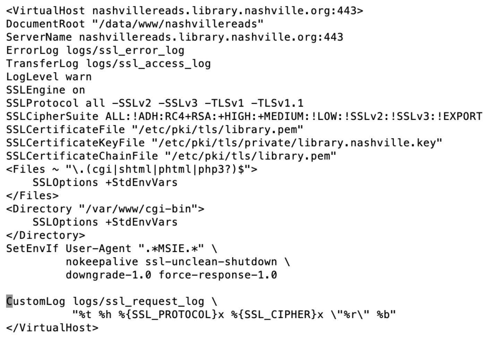

# Redirecting a Subdomain on Bucket

## View the Stanza for the HTTP version of the Site

1. Go to /etc/httpd/conf: `cd etc/httpd/conf`

1. Edit the httpd.conf file: `sudo nano httpd.conf`

1. Go to the bottom of the file where the virtual hosts stanzas are.

1. Update the stanza to change the “Redirect Permanent URL” to the correct URL.

1. Save.

1. Restart apache: `systemctl restart httpd`

1. Make sure apache is running: `systemctl status httpd.service`

1. Test on the web to see if the http redirect works.

1. Test other sites on Bucket to make sure you didn’t kill them.
      1. [https://salon.library.nashville.org](https://salon.library.nashville.org)
      1. [https://assets.library.nashville.org/css/aspen-widgets.css](https://assets.library.nashville.org/css/aspen-widgets.css)

1. Make sure that the Virtual Host settings here match what is in the ssl.conf file.

## View the Stanza for the HTTPS version of the Site

1. Go into /etc/httpd/conf.d: `cd etc/httpd/conf.d`

1. Edit the conf file with nano: `sudo nano ssl.conf`

1. Go to the bottom of the file where the virtual hosts stanzas are.

1. Update the stanza to add “Redirect permanent / [URL for the redirect to point to”.

1. Test on the web to see if the http redirect works.

1. Test other sites on Bucket to make sure you didn’t kill them.
      1. [https://salon.library.nashville.org](https://salon.library.nashville.org)
      1. [https://assets.library.nashville.org/css/aspen-widgets.css](https://assets.library.nashville.org/css/aspen-widgets.css)

1. Update the stanza to add “Redirect permanent / [URL for the redirect to point to.”

1. Save

1. Restart apache: `systemctl restart httpd`

1. Make sure apache is running: `systemctl status httpd.service`

1. Test on the web to see if the https redirect works.

1. Test other sites on Bucket to make sure you didn’t kill them.
      1. [https://salon.library.nashville.org](https://salon.library.nashville.org)
      1. [https://assets.library.nashville.org/css/aspen-widgets.css](https://assets.library.nashville.org/css/aspen-widgets.css)

1. Make sure that the Virtual Host settings here match what is in the httpd.conf file.
