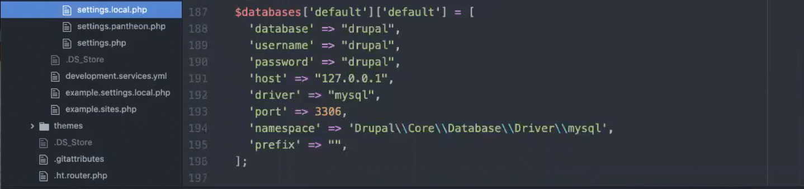
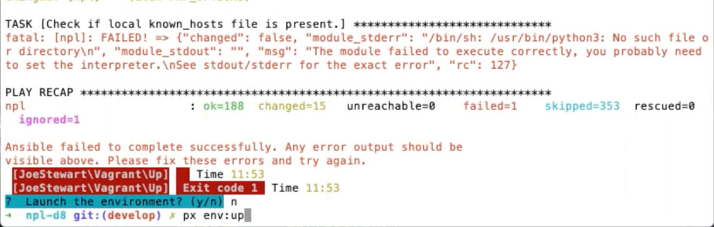

# Set Up NPLD8 on a Staff MAC

Set up a staff computer so staff person can work on NPL Drupal site. Local development environment is based on DrupalVM.

See video from setting up Cook and Ellis local development environments on Z: [need to link on onedrive](Aten Training_2020-07-13_D8-Project-X-Setting-up-with-DrupalVM-Vagrant-Ansible_fixing-cook-ellis-macs)

## Requirements

Below is an overview of requirements and how they're used. Download by following the instructions in the next section because some tools need to be installed in a certain order.

- **Composer**: Tool for dependency management in PHP. Drupal 8+ requires Composer.
- **VirtualBox**: Tool to create a VM where you can run a different operating system within your own computer. We're using VirtualBox for local development to mimic the environment that we have on Pantheon so that we're developing on the same stack we have remotely.
- **Vagrant**: Tool that wraps around VirtualBox that allows you to automate configuration of a VM. Configurations are stored in a Vagrantfile. Running `vagrant up` triggers the installation of all the configurations outlined in the Vagrantfile which ensures that multiple developers will all be using the same environment. By using both VirtualBox and Vagrant, you can simulate the production environment on Pantheon (or whoever hosts the live site).
- **Ansible**: Tool that wraps around Vagrant that allows you to automate the installation of configurations stored in a "playbook." Vangrant runs the playbook you've written once the VM is booted up.
- **Project-X**: Tool that wraps around Vagrant that manages the whole Drupal project (bringing up the environment, moving things along with tickets, installing Drupal, managing things within Drupal, etc.). If we change development environments, we'll update settings and none of the commands we use will have to change.
- **PHP 7.2** (or higher)

## Download and Install Software

1. Download and Install Composer:
    1. Install Brew:
    Go to [brew.sh](https://brew.sh/) and follow directions for Mac.
    1. Install Composer:  
    `brew install composer`

1. Download and Install VirtualBox:
    1. Download at [virtualbox.org/wiki/Downloads](https://www.virtualbox.org/wiki/Downloads)
    1. Install following prompts. We install this first because Vagrant may have a dependency on VirtualBox.

1. Download and Install Vagrant:
    1. Download at [vagrantup.com/downloads](https://www.vagrantup.com/downloads)
    1. Install following prompts.

1. Download and Install Ansible:
    1. On Mac:  
    `brew install ansible`

## Set Up Local Development Site with Project-X

1. Description NEEDS WORK: Clone project to your local Sites folder (or wherever you keep local sites):  
`git clone [add info here]`

1. Description NEEDS WORK: Pull latest code.  
`git pull origin develop`

1. Description NEEDS WORK: In terminal, go into the project folder:  
`cd ~/Sites/npl-d8/web`

1. Install configurations from composer.lock file.  
`composer install`

1. Add a Project-X shortcut so that you can type "px" insetad of "vendor/bin/px" when we do Project-X commands:
    1. Run command:  
    `vendor/bin/px`
    1. Run command:  
    `vendor/bin/px core:cli-shortcut`  
    1. Say yes:  
    `y`
    1. Run the command provided in terminal:  
    `source /Users/[your-username]/.zshrc`

1. Create local settings. This command will add database info to the settings.php and settings.local.php files.  
`px drupal:local-setup`

1. Check the database settings to verify the local-setup command worked.
    1. If you see settings below, all is correct.
    
    1. If the settings do not match the image, delete the settings.local.php file then run the `px drupal:local-setup` command again.
    1. Check to see that the database settings now match the image above.  

## Bring Up Local Dev Site and Get Database

1. Log in to Terminus.
    1. See if you're already logged in:    
    `px pantheon:info`
    1. If you're not logged in, run one of these commands to log in:  
    `terminus auth:login --machine-token=[add token here]`  
    or  
    `terminus auth:login --email=[email address used in Pantheon]`

1. Bring up the local environment. This should provision the VM and bring up the box. You may get the error "the site cannot be reached," which is fine and just indicates that we don't have a database yet.  
`px env:up`

1. Sync the database from Pantheon. Run the sync command, then choose live:
```
px pantheon:sync
live
```

1. If you get an error, try starting the environment again. You might need the download and provisioning to happen again.  
`px env:up`

1. You should see a prompt asking "launch environment." Say yes.  
`yes`

1. Sync the database from Pantheon. Run the sync command, then choose live:
```
px pantheon:sync
live
```

1. The local environment should open in a browser.
    1. If the environment throws an error, clear the cache:
    `px drupal cr`
    1. Reload the browser. If the environment still throws an error, make sure settings.local.php has the following at the bottom. If not, add and save that file:
    ```
    /**
    * Disable the HTTP client SSL verify for develop.
    */
    $settings['http_client_config']['verify'] = FALSE;
    ```
    1. Reload the browser.

## Troubleshooting

### Issue Installing Ansible

Error: “An unexpected error occurred during the `brew link` step. The formula built, but is not symlinked into /usr/local. Permission denied @ dir_s_mkdir - /usr/local/Frameworks.”

1. Open a new tab in terminal.

1. Make sure there is a Frameworks directory. If not, run:  
`brew link ansible`

1. See if Vagrant works:  
`vagrant --version`

1. Uninstall Ansible:  
`brew uninstall ansible`

1. Reinstall Ansible:  
`brew install ansible`

### Issue Bringing Up Environment

1. If you see an error that says "/usr/bin/python3: no such file," this is a problem with DrupalVM that isn't a big deal. Same with "Ansible failed to complete" error. You can ignore the error.


1. If issues with bringing up the local environment persiset, try ininstalling and reinstalling Ansible:
    1. Uninstall Ansible:  
    `brew uninstall ansible`
    1. Reinstall Ansible:  
    `brew install ansible`

1. Try restarting the environment:  
`px env:restart`

### Issue Logging in with Terminus

1. Try updating PHP:
`brew upgrade php`

1. If you get an error that "php not installed," install PHP:  
`brew install php`

1. If you still get an an error that "php not installed," remove icu4c:  
`brew uninstall --ignore-dependencies icu4c`

1. If it still doesn't work, try updating node:  
`brew upgrade node`

1. If it still doesn't work, try reinstalling php:  
`brew reinstall php@7.1`

1. If it still doesn't work, try:  
`brew uninstall php@7.1`

1. Then install 7.2:  
`brew install php@7.2`

1. Try logging in with Terminus again.
