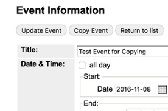

# Copy an Event

If you are adding an event, or event series, that has already been posted at an earlier date, you can use it to recreate a new event.

1. Click the `Approval Queue` tab.
1. Using the search and date-picker functions, Find, and select, an upcoming or past event on the calendar.
1. Choose `Tag or Edit Event`
1. Under Recurrence, choose `Edit Master Event`
1. Click `Copy Event`. If `Copy Event` is not present, go to an instance, then use back button to return to master event.
1. Change the date and time for the next instance (or series) of the event.
1. Click `Add Event`.
