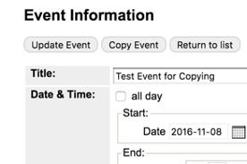

# Copy an Event

If you are adding an event, or event series, and event from an earlier date is already on the calendar, you can use it to recreate a new event.

## From an Existing event

1. Using the search and date-picker functions, Find, and select, a past event in Manage Events. Use "all groups" to broaden scope of search.
2. Select the event you want to copy.
6. Click `Copy Event`. If `Copy Event` is not present, go to an instance, then use back button to return to master event.
7. Change the date and time for the next instance (or series) of the event.
8. Click `Add Event`.

## From Approval Queue

1. Navigate to `Approval Queue`
1. Find your event. Choose `Edit Master`
1. Click `Copy Event`.
1. Change the date and time for the next instance (or series) of the event.
1. Click `Add Event`.
