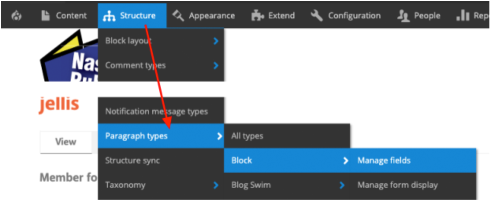
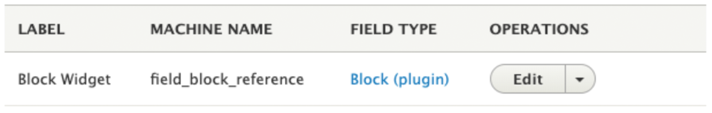
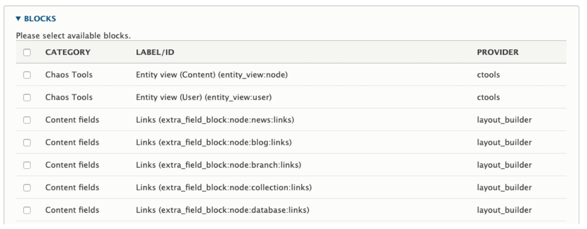
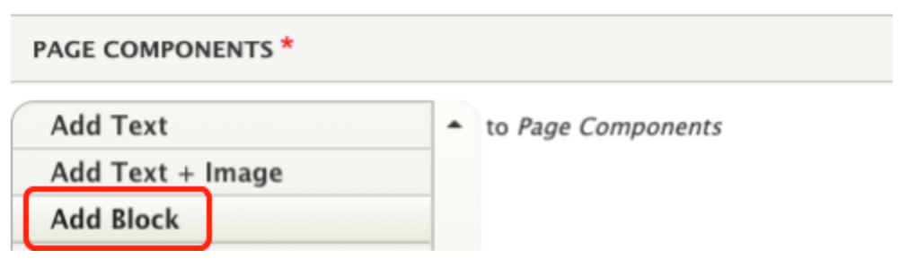
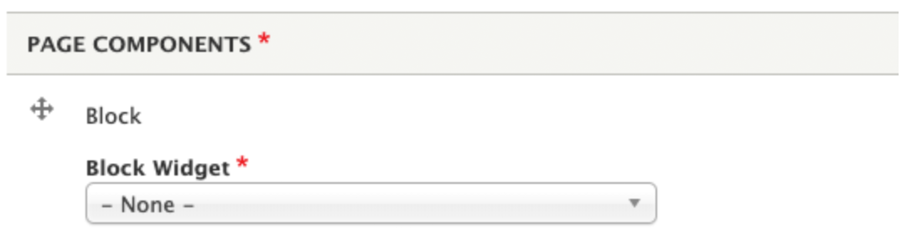
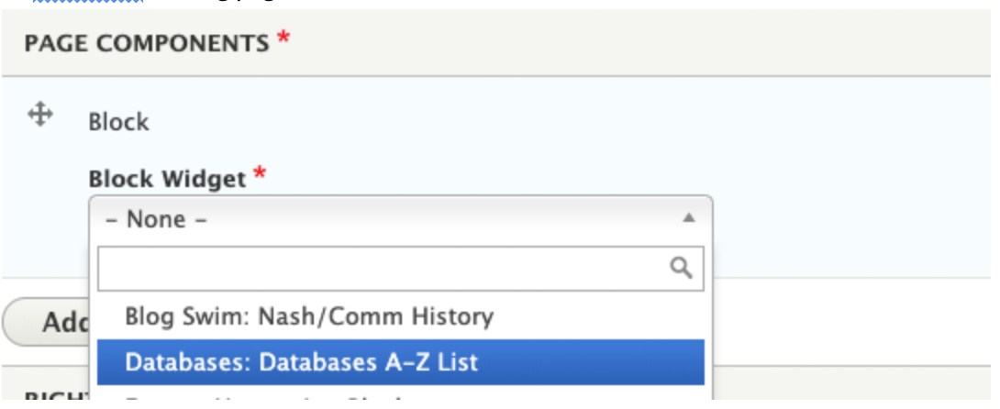

# Block (Admin Only)

The block component is used by site admins to make views available to the block paragraph type, to add Components JS blocks, or to add other custom blocks to pages on the site.

## Make a Custom Block Available to the Block Paragraph

Before you can add a custom block to content, it has to be made available to the Block paragraph type (component).
**Important! You must do this step in your local development environment, export code, commit, and deploy to live.**

1. Create your custom block in views, Components JS, or elsewhere in Drupal.  

1. Go to Structure > Paragraph Types > Block > Manage Fields  

1. Click Edit next to the Block Widget field.  

1. Click the checkbox next to the block you need to make available to the block paragraph type.  

1. Save.

## Add a Custom Block to Content

Add any available block to your content.

1. In your content area, select the block component from the list.  

1. Use the dropdown menu to see the available blocks.  

1. Select the block you want to add to the content area. In this example, we’re adding the Database A-Z block to the databases landing page.  

1. Save.

1. Review the page and make sure the block is displaying correctly, that any links function, and that the content is displaying as expected.
