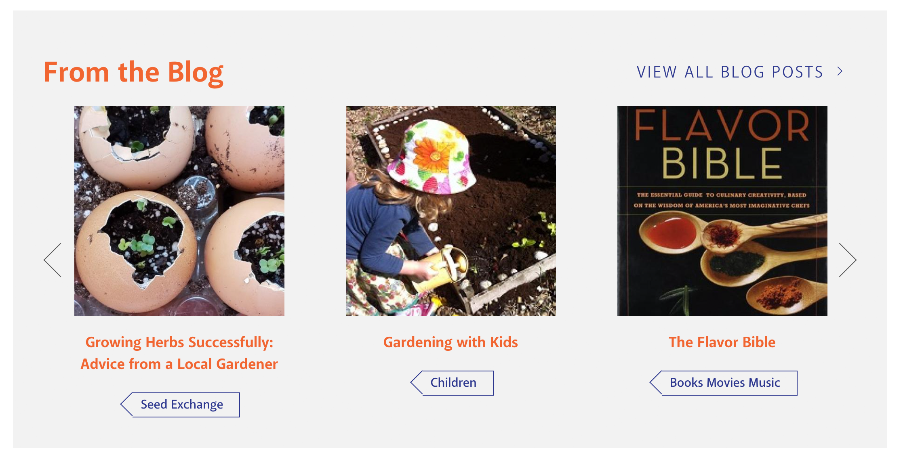
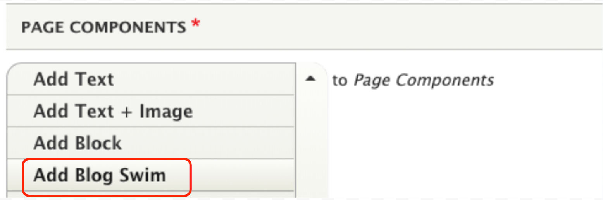
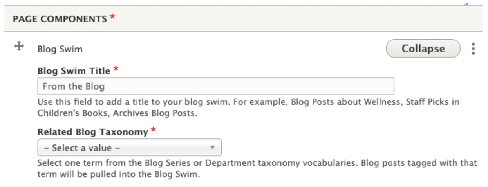

# Blog Swim

The Blog Swim component is used to add a topic-specific list of blog posts to a page. For example, we might add a list of blog posts tagged “Be Well at NPL” to the Be Well at NPL webpage.

## Add a Blog Swim

1. In your content area, select the blog swim component from the list.

1. Fill out the form.
  
      1. Blog Swim Title: The default setting is “From the Blog” but you can customize this. If you do change the title, keep the new title short, 4-5 words max.
      1. Related Blog Taxonomy: Select the blog tag that will be used to pull in content. The blog swim will only show blog posts tagged with the selected term.

1. Save.

1. Review your blog swim to make sure that the title is correct, the links work, and that the expected content is displaying.
