# Calendar Widget

The Calendar Widget component is used to add a short list of Bedework calendar events to a page. There are two widget options.

## Add an Upcoming Events Calendar Widget

Horizontal, topic-specific list of events used on program and event pages.

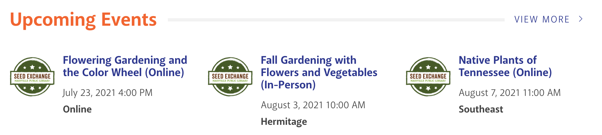

1. In your content area, select the calendar widget component from the list.
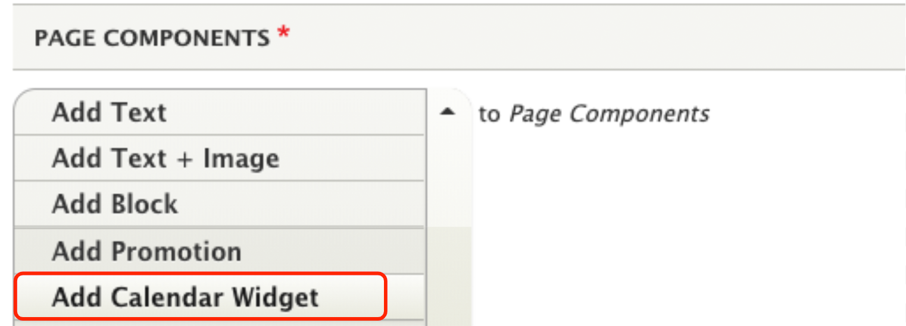

1. Use the dropdown to select an Event Widget. Do not select Attend an Event unless you are a site admin.
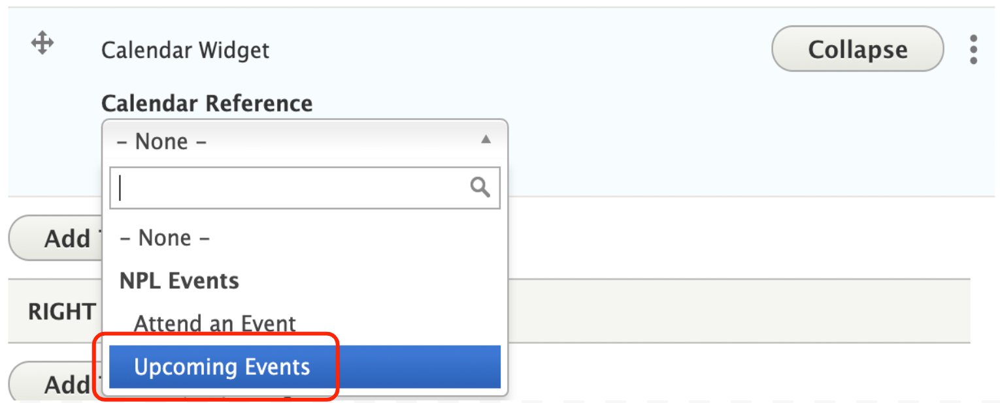

1. Fill out the form.  

      1. Title: The default title is “Upcoming Events.” You can add an alternate title if you prefer. Leave the checkbox next to "Display Title" checked.
      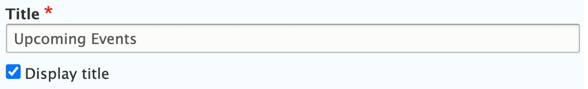

      1. Appearance -> Display Columns: Select 3 columns.
      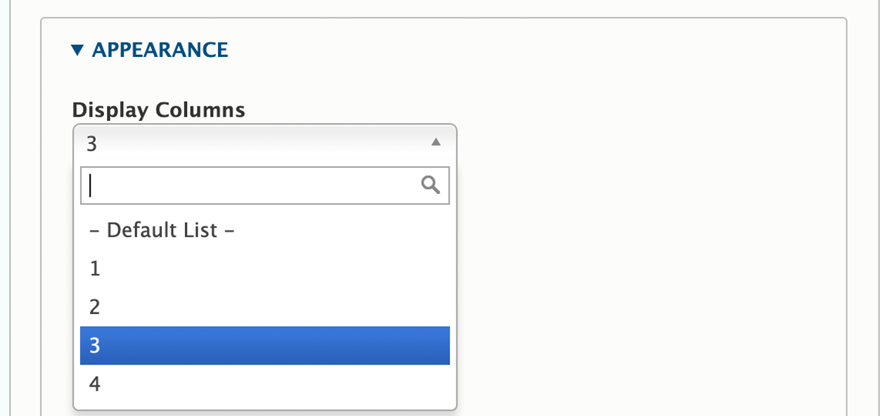
      1. Appearance -> Hide Properties: Only select the options you do NOT want to display. We usually hide the description for horizontal event displays.
      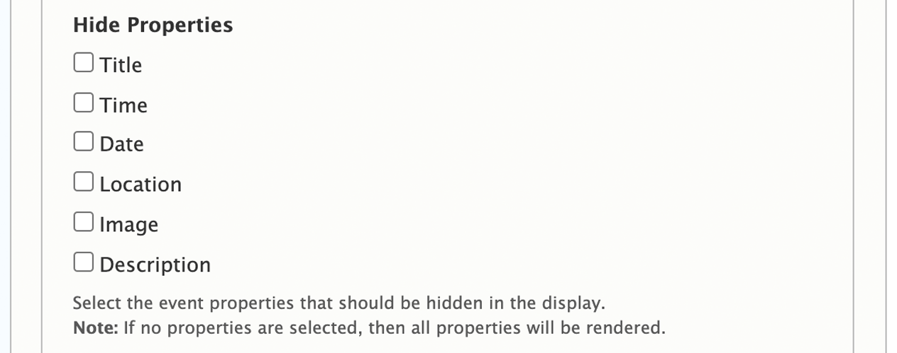
      1. Appearance -> Link URL: Add a bit.ly link to take users to a filtered Bedework list of events. This will display as the “view more” link in the upper right of the widget.
      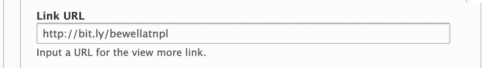

      1. Bedework Query -> Query Count: Set to 3.
      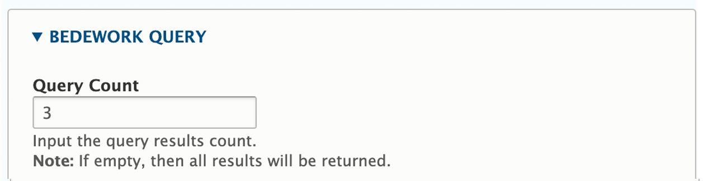
      1. Bedework Query -> Query Expression: Select tags for Audience, Location, Topic, and/or Series. Do not make your search too specific or it will not return results.
      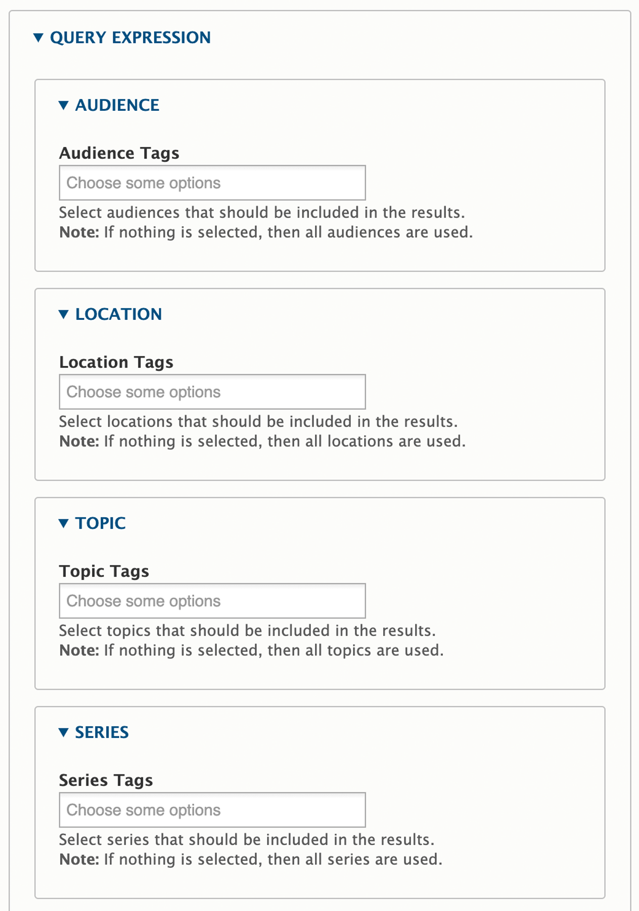

1. Save.

1. Review the results on the webpage. Edit if necessary.

## Add an Attend Event Calendar Widget

Vertical, orange widget seen on the home page and location pages. This widget may also be used on the landing page content type in a two-column layout.

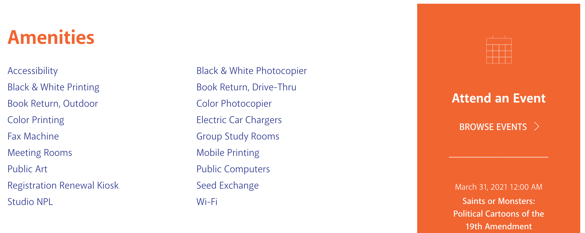

1. In your content area, select the calendar widget component from the list.
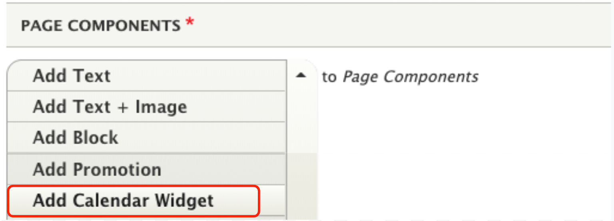

1. Use the dropdown to select Event Widget. Do not select Attend an Event unless you are a site admin.
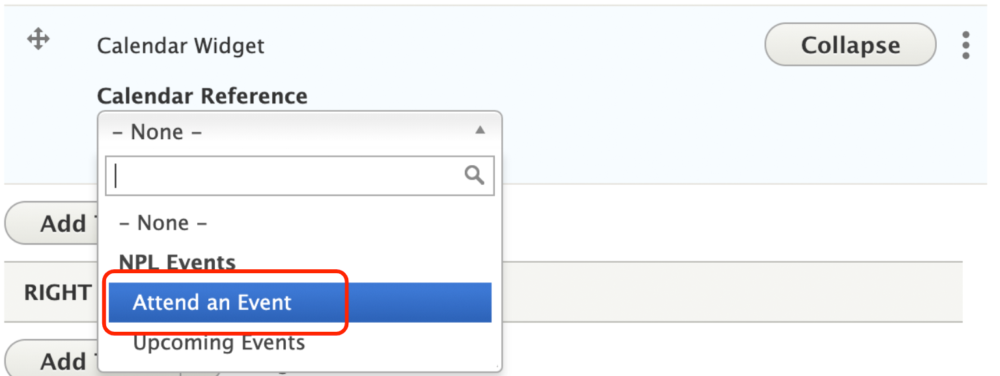

1. Fill out the form.

      1. Title: The default title is “Attend an Event.” You can add an alternate title if you prefer. Leave the checkbox next to "Display Title" checked.
      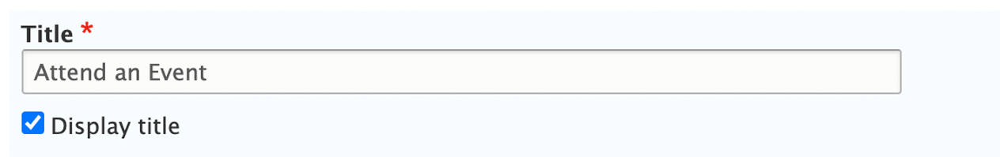
      1. Bedework Query -> Query Count: Set to 5 for homepage. Adjust as needed for other pages.
      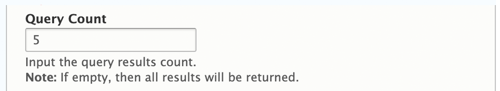
      1. Bedework Query -> Query Expression: Select tags for Audience, Location, Topic, and/or Series. Do not make your search too specific or it will not return results.
      

1. Save.

1. Review the results on the webpage. Edit if necessary.
