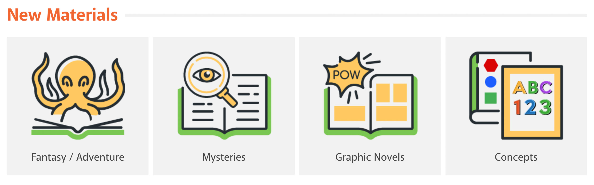
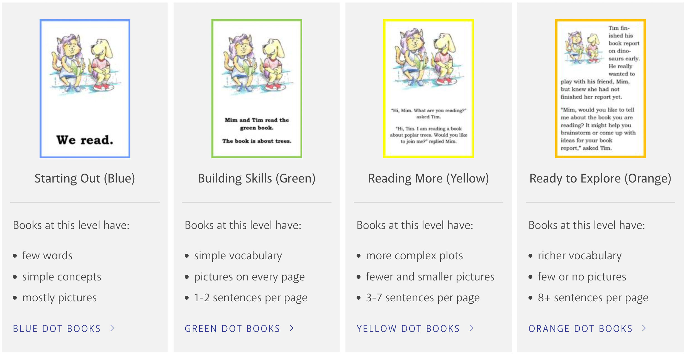
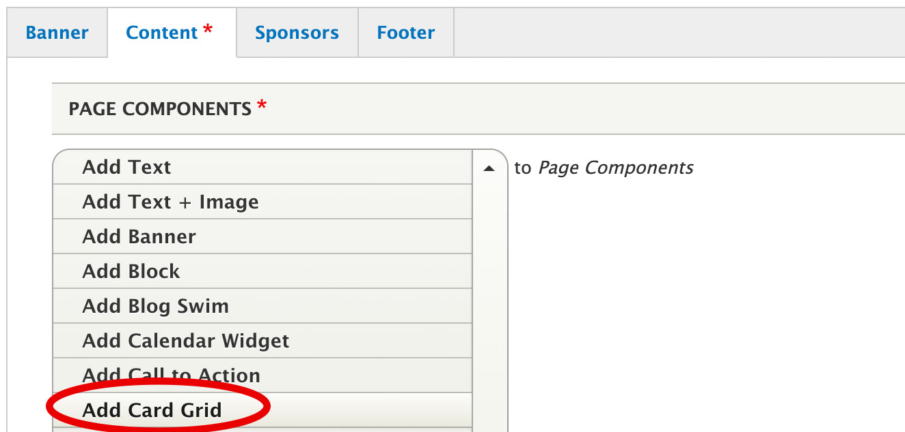
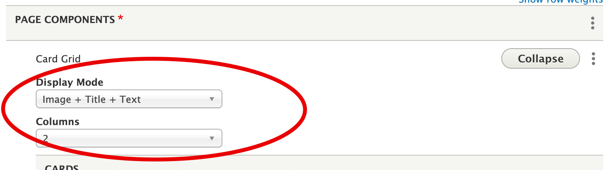

# Card Grid

Use to add a 2, 3, or 4 column grid of cards to a page.  

- You'll first add the card grid, then add individual cards to the card grid component.  
- Cards should be used for displaying a grid of related content.  
- Cards can include a title, an image, and a content area. Content should be limited (only a few sentences).  

Available for use on basic page, service, and sub-page.

## Examples

### Text Component above a Card Grid Component

### Card Grid Component

## Add a Catalog Widget Grid to the Website

1. Create a new basic page, service, or sub-page.

1. Add the Card Grid component to your page.

1. Select your display mode and number of columns.

      1. Display mode denotes which card design is displayed. There are two options:
         1. Image + Title + Text will display the image at the top of the card, followed by the title, then content.
         1. Title + Image + Text will display the title first, followed by the image, then content.
      1. Columns determines the number of cards/columns displayed in a row. There are 3 options (2, 3, or 4 columns).

1. Create your cards. The first card form is ready to fill out. Use the "add card" button to add additional cards. No elements are required, so you can mix and match to make whatever card is needed. However, all cards within a card grid should include the same content.
      1. Title: Enter the text to display as the card title.
      1. Linked Image URL: If you're using an image that should be linked, add the link URL here.
      1. Image: If your card will include an image, add it here. Image size should be at least 250px wide or 250px high. Make all images in a card grid a uniform size.
      1. Content: Add text and list items, if needed.

1. Repeat the steps above until you have the desired number of cards.

1. Save.

1. Review content before publishing.
