# Collection Spotlight

Use a Catalog Widget to recommend a long list of titles in a blog post or on a web page.

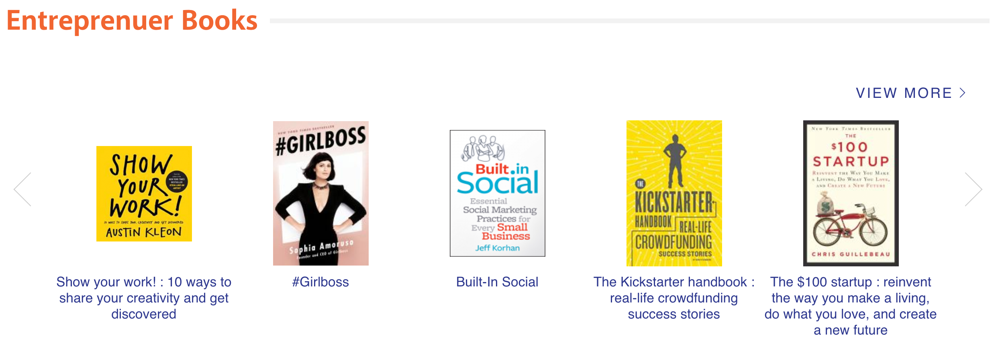

## Note about lists in Aspen

Lists in Aspen have three options:

- Private: Can be seen only by the user that created it within their My Account page.
- Public: Can be shared via URL but otherwise will be same as Private; e.g., https://catalog.library.nashville.org/MyAccount/MyList/63302
- Show in Search Results: This option is only available if the list is marked 'Public' and the user has an elevated permissions.  

'Show in search results' lists, aka searchable lists, will appear in the scoped collection 'Lists':

- They are what you search when you choose 'in Lists.' Searchable lists will also appear in the Explore More widget.
- Finally, searchable lists will appear in the 'Appears on list' field of a record:

## Create Catalog Spotlight in Library Catalog (Using a List)

1. Go to [https://catalog.library.nashville.org](https://catalog.library.nashville.org).

1. Create a list. If you already have a list, skip this step.

1. Go to the lists page:
      1. Click the user icon in the upper right.
      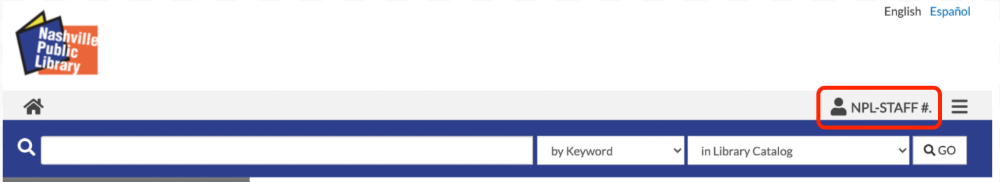
      1. Select “lists” from the menu.
      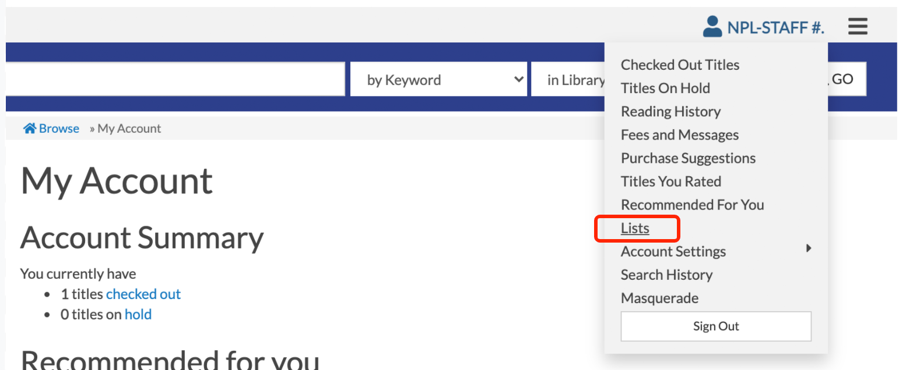

1. On the list page, click the Edit button.
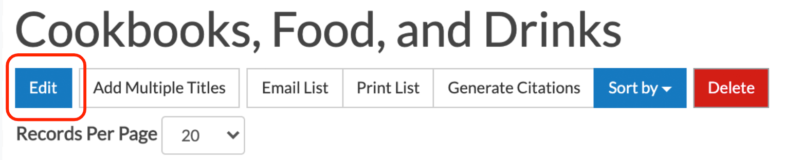

1. On the edit screen, mark the list public. Your list must be public to create a catalog spotlight.
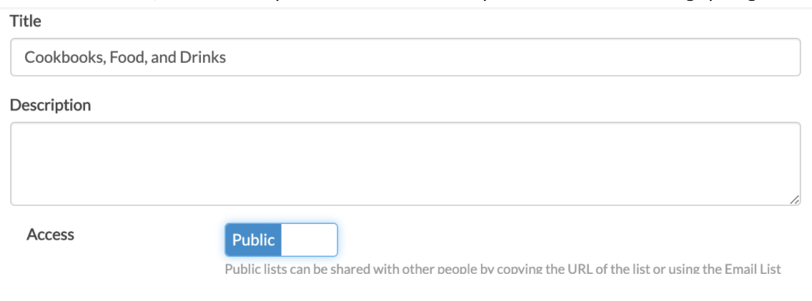

1. Once your list is marked public, you have the option to include or exclude the list from search results. Select yes or no, then click Update to save your changes.
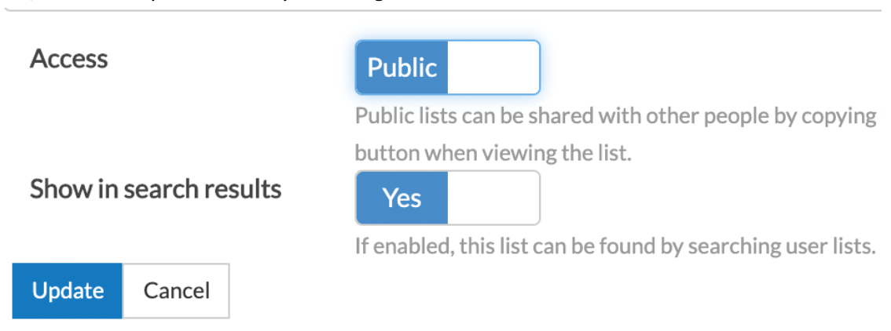

1. After saving your changes, you’ll see “create spotlight” at the top of your list. Click “create spotlight.”

1. You’ll be asked to give your spotlight a name. We recommend naming the spotlight the same as your list so the spotlight and list titles match. **IMPORTANT! Your spotlight title must have less than 50 characters.**
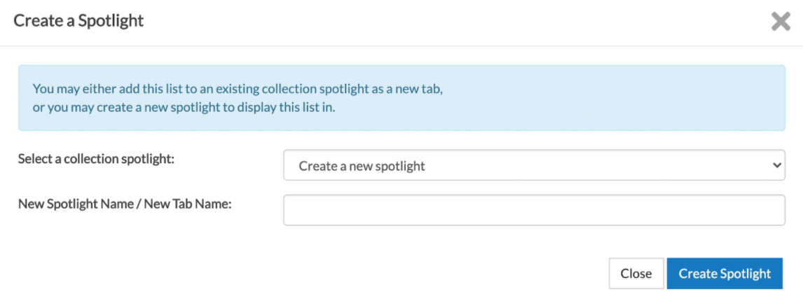

1. On the next page, we need to customize the widget. Click Edit.
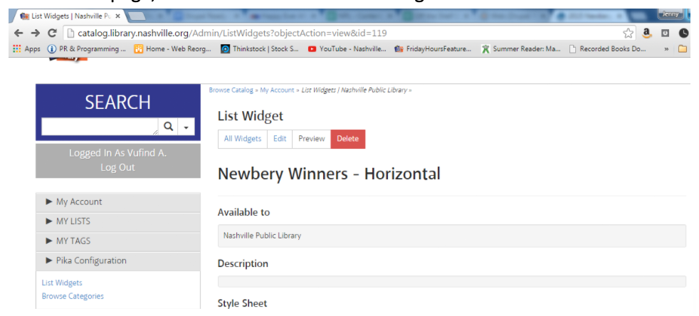

1. Fill out the following fields:
      1. Name: If you need to edit the spotlight name, do it here. The name must be less than 50 characters.
      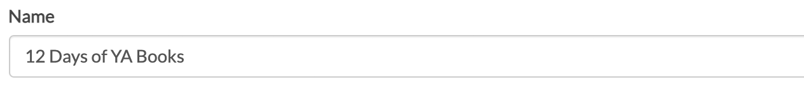

      1. Description: Add a note about where the widget is used. If you’re adding to a blog post, type something like “widget for newbery winners blog post 2015.”
      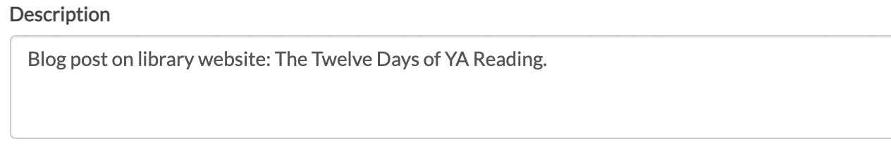

      1. Number of Titles: Default is 25, which is generally a good number. You can make this smaller if you like.
      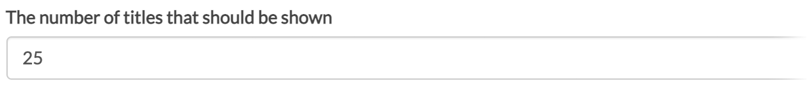

      1. Uncheck the next three boxes. We do not want to show the title, author, or ratings for titles.
      

      1. Style When Displaying List Widget: Choose Horizontal Carousel.
      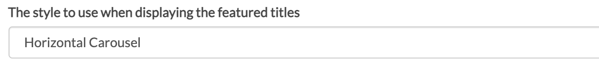

      1. Cover Size to Use: Choose Medium.
      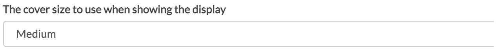

      1. Custom CSS File: Use https://assets.library.nashville.org/css/aspen-widgets.css
      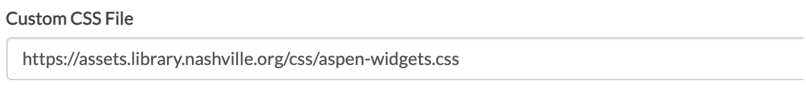

      1. Cover Size to Use: Medium
      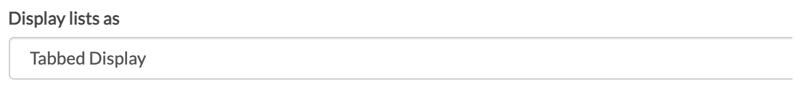

      1. For the next two boxes: Uncheck “show list widget title bar.” But DO check “show the view more link.”
      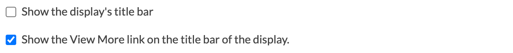

      1. Display Mode for Search Results: Choose Covers.
      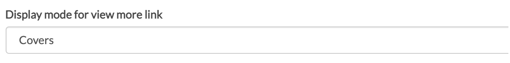

1. Click Save Changes and Return.

1. Scroll down until you can see the “Collection Spotlight with Resizing” code. Copy ONLY the iFrame URL -- this is the URL in the blue box above the iFrame code. You do NOT need the entire iFrame code snippet. You only need the URL, like the example highlighted below.
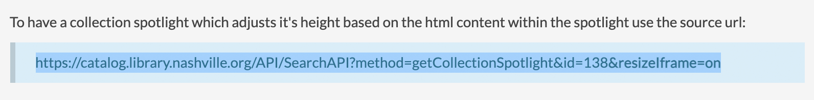

## Create Catalog Spotlight in Library Catalog (Using a Search)

1. Go to [https://catalog.library.nashville.org](https://catalog.library.nashville.org).

1. Do a search.

1. If you do a search AND you’re logged in to your account, Create Spotlight will be at the bottom of the screen, just above the footer.

1. Click “create spotlight.”

1. You’ll be asked to give your spotlight a name. We recommend naming the spotlight the same as your list so the spotlight and list titles match.

1. On the next page, we need to customize the widget. Click Edit.

1. Fill out the following fields:
      1. Name: Give your widget a name.
      

      1. Description: For description, specify who created the list it’s based on, and when it was created, and where this widget will be used (home page, Books Movies Music). For example: _List created by Jane Librarian, for Blog post on library website: The Twelve Days of YA Reading, Dec 2020._
      

      1. Number of Titles: Default is 25, which is generally a good number. You can make this smaller if you like.
      

      1. Uncheck the next three boxes. We do not want to show the title, author, or ratings for titles.
      

      1. Style When Displaying List Widget: Choose Horizontal Carousel.
      

      1. Cover Size to Use: Choose Medium.
      

      1. Custom CSS File: Use https://assets.library.nashville.org/css/aspen-widgets.css
      

      1. Cover Size to Use: Medium
      

      1. For the next two boxes: Uncheck “show list widget title bar.” But DO check “show the view more link.”
      

      1. Display Mode for Search Results: Choose Covers.
      

1. Click Save Changes and Return.

1. Scroll down until you can see the “Collection Spotlight with Resizing” code. Copy ONLY the iFrame URL -- this is the URL in the blue box above the iFrame code. You do NOT need the entire iFrame code snippet. You only need the URL, like the example highlighted below.

## Add the Widget to the Website

1. Add the Catalog Widget component to your post.
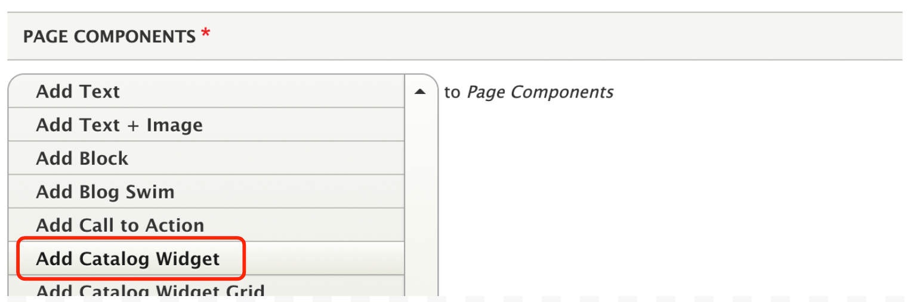

1. Fill out the form:
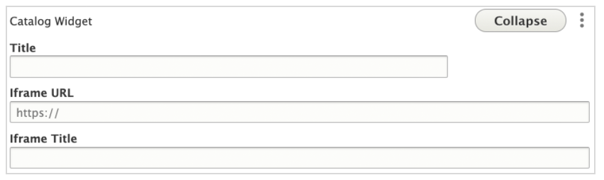
      1. Title and iFrame Title: The type title for your widget that will display to the user.
      1. iFrame URL: Paste the iFrame URL from the widget code in catalog.
      1. iFrame Title: Use the same title in both the Title and iFrame Title fields.

1. Review and verify that the widget looks correct. If anything looks weird, check your widget settings.

## Find the List or Saved Search that Populates a Widget

1. Go to [https://catalog.library.nashville.org](https://catalog.library.nashville.org).
1. Log in using the List Admin account.
1. Select **Pika Configuration**.
1. Select **List Widgets**.
1. Search for the list that appears on the BMM page.  
      1. Click in the empty text box under Description.
      1. Paste in one of these searches (see above) and search:
         1. children's books movies music page
         1. teen books movies music page
         1. adult books movies music page
1. Note the List Title and List ID or Saved Search ID.
      1. You’ll need the List Title if you want to add titles to the list.
      1. You'll need the List ID or the Saved Search ID to easily find the list and remove items.

## Remove Titles from a Widget List

1. Go to [https://catalog.library.nashville.org](https://catalog.library.nashville.org).
1. Log in using the List Admin account. If you do not know the List Admin account number, contact Shared Systems.
1. Copy this URL into your browser and replace _insert-list-id_ with the List ID number you pulled from the widget description: `https://catalog.library.nashville.org/MyAccount/MyList/` *insert-list-id*. You can also go to My Lists and look for the list by name.
1. Select **Edit**.
1. Remove titles by clicking **Delete** on the far right of each item block.

## Add Titles to a Widget List

1. Go to [https://catalog.library.nashville.org](https://catalog.library.nashville.org).
1. Log in using the List Admin account. If you do not know the List Admin account number, contact Shared Systems.
1. Search for a title.
1. When you locate the title, click the **Add to List button**.
1. Select the list from the drop down menu.
1. Save.

## Update a Widget Based on a Saved Search

1. Go to [https://catalog.library.nashville.org](https://catalog.library.nashville.org).
1. Log in using the List Admin account. If you do not know the List Admin account number, contact Shared Systems.
1. Search for a topic and apply filters.
1. Enter.
1. If the search looks good and is returning the type of titles you expect, click Save Search at the bottom of the screen.  
1. In the left menu, select My Account > Search History.
1. Copy the search ID for the search you just saved (it will be at the top).
1. Select Pika Configuration.
1. Select Catalog Spotlights.
1. Find the widget you need to update and select Edit.
1. In the Source field at the bottom of the widget, replace the search ID with the new number. It should say _source:xxxxxx_ where x is the new number.  
1. Save changes.
1. Go to the BMM page where the widget lives and make sure the changes took effect as expected.

## Update 5-Tab Widget on the Homepage

1. Create your new list in Pika with lists account.
1. Locate the existing 5-tab widget:
      1. Go to [https://catalog.library.nashville.org](https://catalog.library.nashville.org).
      1. Log in with lists account
      1. Click on Pika Configuration
      1. Select Catalog Spotlights
      1. Find “Drupal Home Page - 5 Format Catalog Widget”
1. Edit the existing Drupal Home Page - 5 Format Catalog Widget.
      1. Swap out one of the old lists for the new lists by updating the list number.
      1. There is no need to edit anything on Drupal. Your list should automatically update on Drupal.
1. Double check the homepage to verify the widget updated correctly.

## Widget Settings

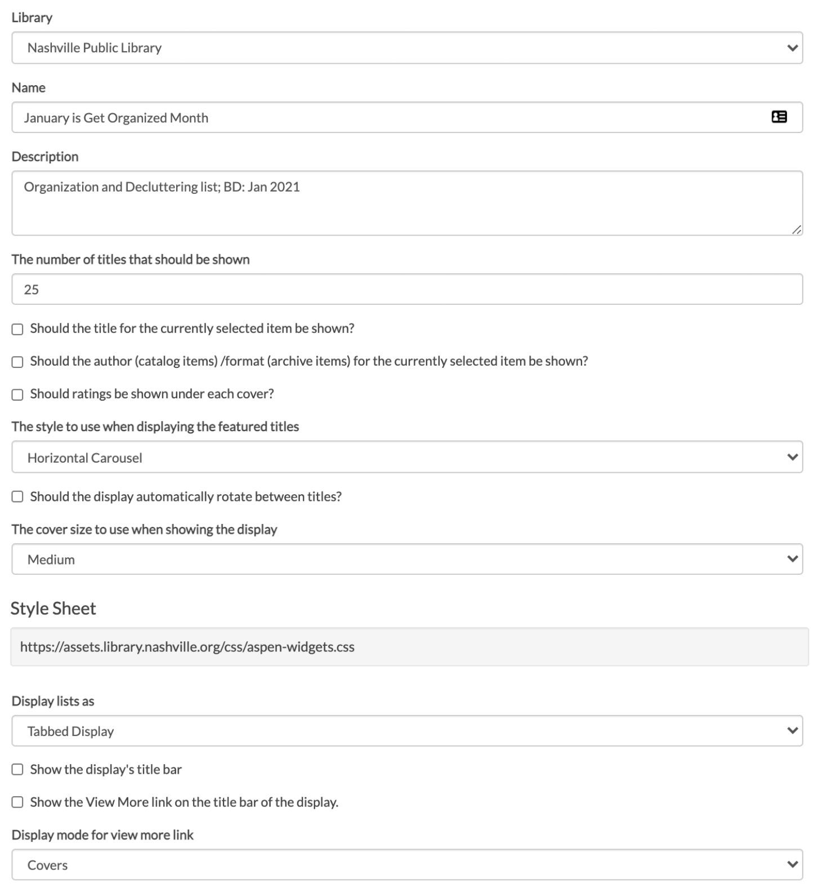
