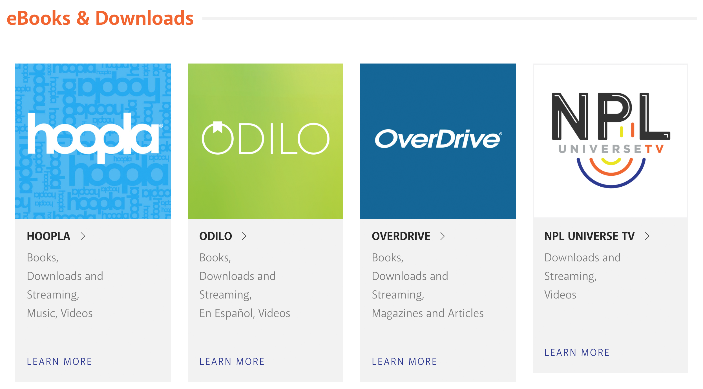
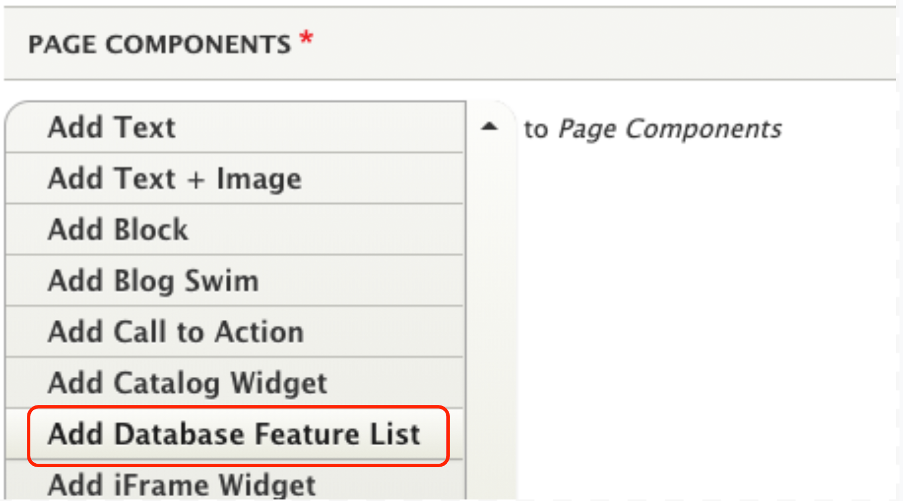

# Database Feature List

Use the Database Feature List when you want to add a topical list of databases that directly relate to the content of a page.

## Add a Database Feature List

1. In the content area, add the Database Feature List to your page.

1. Fill out the form.  

      1. Title: Add a title for your database list. For example, “Health and Wellness Resources” is a good title for a database feature on the Be Well at NPL page. Keep your title short, 4-5 words max.
      1. Related Database Age (Required)
         1. Select the age tag(s) that will be used to pull in content.
         1. You may select multiple ages. They combine as follows: Preschool (OR) Elementary (OR) Middle School
      1. Related Database Topic (Required)
         1. Select the database tag(s) that will be used to pull in content.
         1. You may select multiple topics. They combine as follows: Downloads & Streaming (OR) Ebooks

1. Save.

1. Review the feature and adjust as needed. The database feature list will only show databases tagged with the selected age and term tag(s).
