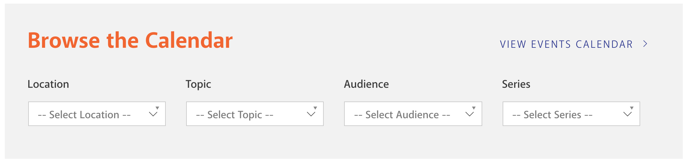
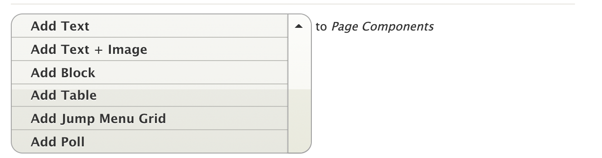
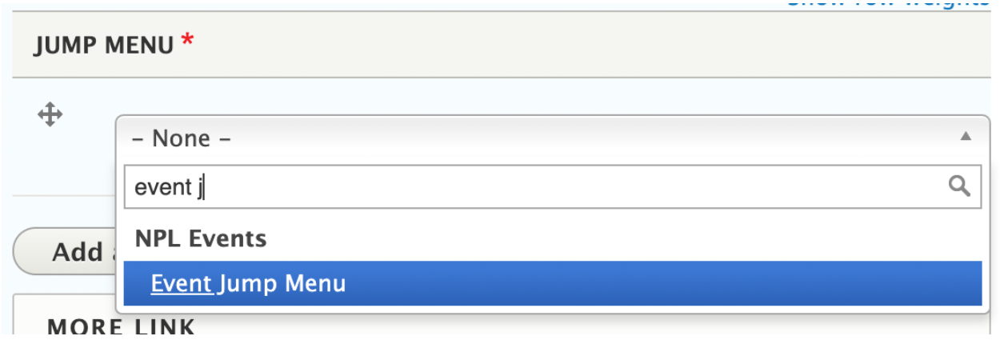
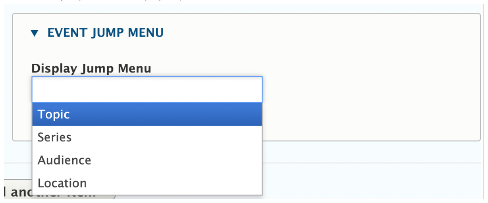
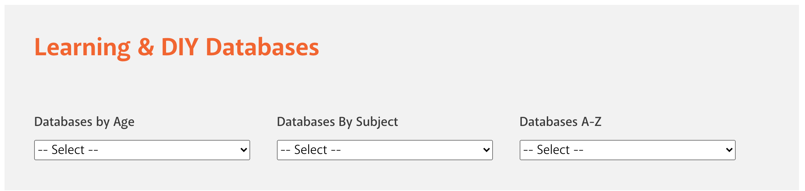
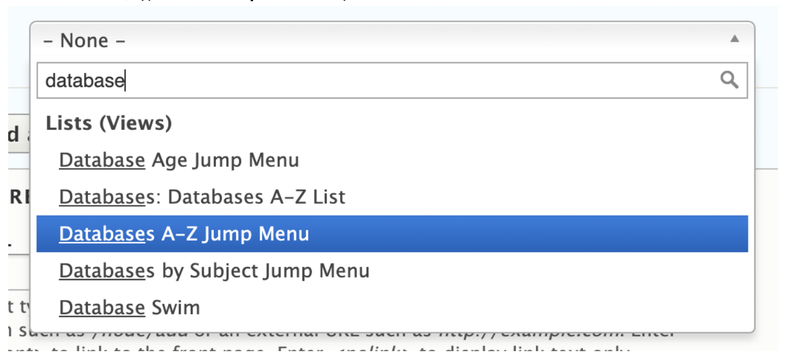

# Jump Menu Grid

The Jump Menu Grid component allows us to add custom jump menus (drop down menus that go somewhere) to pages. Currently it is only used at the top of the Events and Education pages.

## Events Page Jump Menu

### Create the Jump Menu Block

The jump menu block was created in code. We don't have documentation on how to make a new one.

### Add Jump Menu to the Page

1. Add Jump Menu Grid component.

1. In the search box, type "event" to filter the list of options. Select Event Jump Menu, which was created in the previous section.

1. There are several options within the previously created Event Jump Menu. Select which filters to display from Bedework (topic, audience, etc.). Repeat until all menus are added.

1. Save.

1. Verify that the menu looks okay and functions correctly.

## Education & Research Page Jump Menu

### Create the Jump Menu

The jump menu block was created in code. We don't have documentation on how to make a new one.

### Add Jump Menu to the Page

1. Add Jump Menu Gird component.

1. In the search box, type "database" to filter the list of options. Select Databases A-Z from the list, which was created in the previous section.

1. Save.

1. Verify that the menu looks okay and functions correctly.
