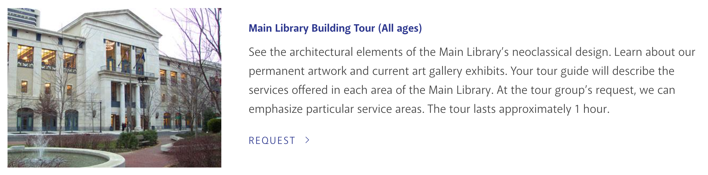
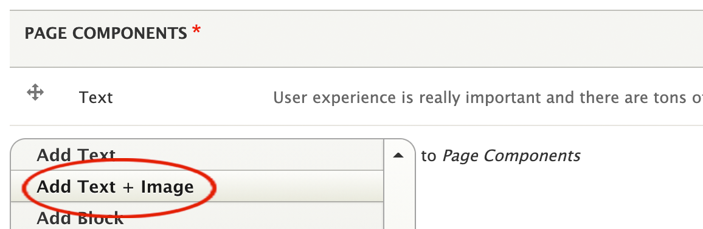
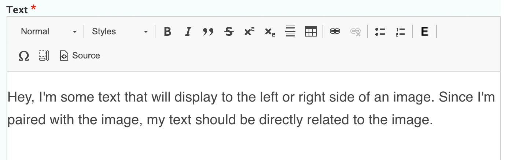
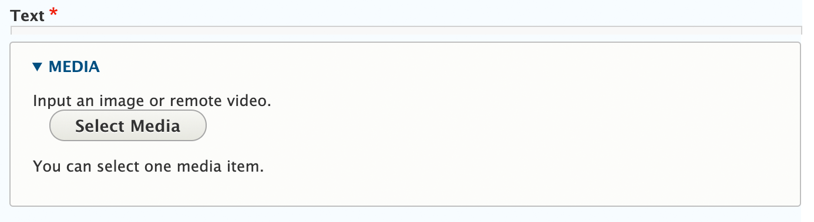
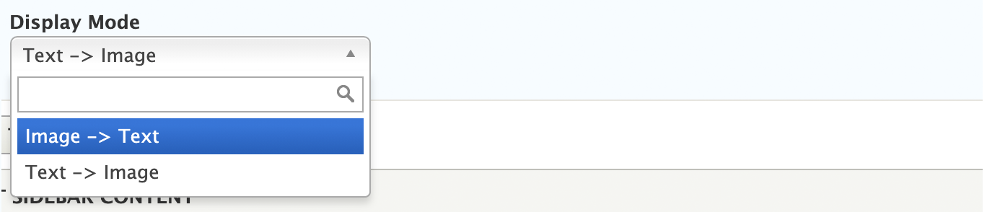
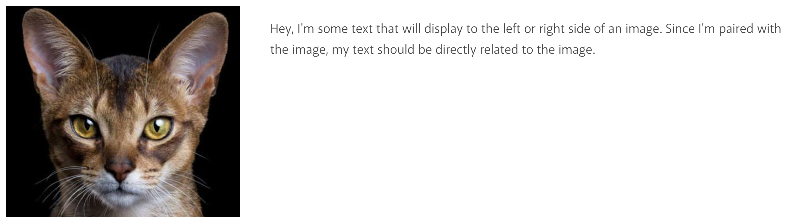

# Text + Image

Use Text + Image to place an image and text block side by side. You can select whether the image will display on the right or the left side of the text. This is good for small amounts of text that need to display next to an image, especially in lists of content where a view was not necessary.

1. Add the Text + Image component to the page.

1. Fill out the form.

      1. Text: Type the body text you want to display next to your image.
      
      1. Media: Add your image.
      
      1. Display Mode: Select whether your image should display on the right or the left.
      

1. Save.

1. Review your image to make sure it looks correct.

