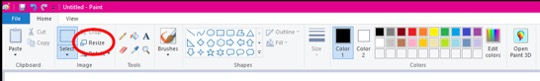
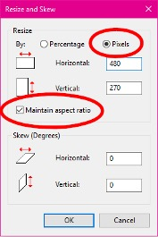

# Image Guidelines

If there is an existing graphic / logo (story time, Studio NPL, etc.), use the established image as the thumbnail image in Bedework. Please don’t create a new image. 

Use the _Image Library_ by going to <u>[Click here to choose from the library of images](../image-library/series-logos.md)</u>. 
1. Use the copy graphic to copy the image URL path. 
1. Use your keyboard shortcut to paste (CTRL+V) the path in the table into the Image URL, Thumbnail URL, and Alt Text fields. The URL paths links will begin `/public/img/`. 
   
- Alt Text is legally required for all images. Patrons using screen readers hear this text read aloud. This should be a description of the image pictured, not just the name of the event. 
- If there is not an existing graphic, create an image one to upload.
- Calendar approvers review the image.
- Images submitted with events may be removed, remade, or replaced, at the approver’s discretion.
- Accepted images are addded to the Images Library accessible from the Bedework entry form for re-use later.

## Size and Text Specifications

- Max width: 400px
- Max height: 600px
- **File size: Less than 100 KB**

## Images are required for the following events

- Be Well at NPL (add image URL from image Library)
- Book Clubs (add image URL from image Library)
- Exhibits (resize and upload artwork image) - must include image b/c they are displayed on Art at the Library page
- Nashville Reads (add image URL from image Library)
- Mental Health Outreach (add image URL from image Library)
- Metro Social Services (add image URL from image Library)
- Seed Exchange (add image URL from image Library)
- Story Time (add image URL from image Library)

## Finding Images

- For existing logos / icons, see Bedework Image URLs
- For book cover and movie posters, see the Library Catalog
- To find new images, see Finding Copyright Friendly Images

## Resizing an Image (on a Microsoft Windows PC)

- Open MS Paint
- Open the image you want to resize, or copy-and-paste an image
- Hit the resize button at the top

- Click the button for "Pixels." Check "Maintain aspect ratio." Type what size you want the image to be, and click “OK.”

- Save the image as a .png file.
